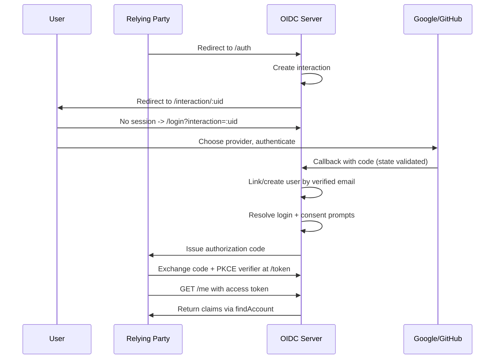

<div align="center">

# 🔐 OIDC Implementation

**A modern, modular OpenID Connect authorization server**

Built with Express · TypeScript · Drizzle ORM · PostgreSQL · Redis · `oidc-provider`

[](https://nodejs.org)
[](https://www.typescriptlang.org/)
[](https://orm.drizzle.team/)
[](https://redis.io/)
[](https://www.docker.com/)
[](#)

</div>

---

## ✨ Overview

This repo demonstrates a spec-compliant, production-minded OIDC provider:

| | |
|---|---|
| 🔑 | Spec-compliant OIDC provider — authorization code, PKCE, and refresh token flows (rotation enforced) |
| 🌐 | Pluggable social login for Google and GitHub, with account linking by verified email |
| 🗄️ | Database-backed OIDC artifacts (sessions, grants, tokens, dynamic clients) via a custom Drizzle adapter |
| 🚦 | Redis-backed rate limiting for auth and token endpoints |
| 🧩 | Dynamic client registration (`/reg`) with initial access tokens |
| 🔒 | Scoped CORS for browser-based clients |
| 🚪 | Logout that revokes grants, not just the local session |
| 🛠️ | A developer-facing client management layer (`modules/clients`) — **in progress**, aiming for a Clerk-style "create an app, get credentials, manage it" experience on top of the raw OIDC protocol |

---

## 📋 Requirements

- Node.js 20+ / LTS
- Docker + Docker Compose
- Bash / Git Bash / WSL for `key-gen.sh`
- OpenSSL installed

---

## 🚀 Quick Start

```bash
cp .env.example .env
npm install
docker compose up -d          # Postgres + Redis
bash key-gen.sh               # RSA signing keys -> keys/
npm run db:generate
npm run db:migrate
npm run dev
```

The server listens on `PORT` from `.env`.

> ⚠️ **Port/URL consistency matters.** `PORT`, `ISSUER_URL`, `GOOGLE_REDIRECT_URI`, and `GITHUB_REDIRECT_URI` must all agree with each other and with whatever's registered in Google Cloud Console / GitHub OAuth App settings. A mismatch here is the most common cause of `redirect_uri_mismatch` or `invalid_client` errors.

---

## ⚙️ Environment Variables

| Variable | Required | Purpose |
|---|:---:|---|
| `PORT` | ✅ | Port the server listens on |
| `DATABASE_URL` | ✅ | Postgres connection string |
| `REDIS_URL` | ✅ | Redis connection string (rate limiting) |
| `ISSUER_URL` | ✅ | Public base URL of this OIDC server |
| `SESSION_SECRET` | ✅ | Secret for signing Express session cookies |
| `OIDC_COOKIE_KEYS` | ✅ | Comma-separated keys for `oidc-provider` cookie signing (separate from `SESSION_SECRET` by design) |
| `OIDC_PRIVATE_KEY_PATH` | ✅ | Path to the RSA private key |
| `OIDC_PUBLIC_KEY_PATH` | ⬜ | Path to the RSA public key |
| `OIDC_JWKS_PATH` | ✅ | Path to the JWKS JSON file |
| `GOOGLE_CLIENT_ID` / `GOOGLE_CLIENT_SECRET` | ⬜ | Google OAuth app credentials |
| `GOOGLE_REDIRECT_URI` | ⬜ | e.g. `http://localhost:8000/auth/external/google/callback` |
| `GITHUB_CLIENT_ID` / `GITHUB_CLIENT_SECRET` | ⬜ | GitHub OAuth app credentials |
| `GITHUB_REDIRECT_URI` | ⬜ | e.g. `http://localhost:8000/auth/external/github/callback` |
| `FRONTEND_URL` | ⬜ | Allowed CORS origin for `/token` and `/me`, default `http://localhost:5173` (Vite) |
| `OIDC_CLIENTS_JSON` | ⬜ | One-line JSON array of statically registered clients |

> 💡 `OIDC_CLIENTS_JSON` must be valid JSON on a **single line** — `dotenv` stops reading a value at the first newline. To request a refresh token, the client's `scope` must include `offline_access`, its `grant_types` must include `refresh_token`, **and** the actual `/auth` request must include both `scope=...offline_access` and `prompt=consent` — all three are required together, not just one.

See `.env.example` for placeholder values. Never commit `.env` or `keys/*.pem`.

---

## 🔌 Supported Endpoints

<details>
<summary><strong>Provider-exposed OIDC endpoints (via <code>oidc-provider</code>)</strong></summary>
<br>

| Endpoint | Purpose |
|---|---|
| `/.well-known/openid-configuration` | Discovery document |
| `/jwks` | Public signing keys |
| `/auth` | Authorization endpoint |
| `/token` | Token exchange (rate-limited, CORS-scoped) |
| `/me` | Userinfo (CORS-scoped) |
| `/reg` | Dynamic client registration — `POST` to create, `GET`/`PUT`/`DELETE /reg/:client_id` to manage (via `registration_access_token`) |
| `/revoke` | Token revocation |
| `/introspect` | Token introspection |
| `/session/end` | RP-initiated logout |
| `/request` | Pushed authorization requests (PAR) |

</details>

<details>
<summary><strong>App-owned endpoints</strong></summary>
<br>

| Endpoint | Purpose |
|---|---|
| `GET /login` | Provider-picker login page |
| `POST /logout` | Revokes all of the user's OIDC grants (and their tokens), then destroys the local session |
| `GET /auth/external/:provider` | Starts upstream OAuth (rate-limited) |
| `GET /auth/external/:provider/callback` | Completes upstream OAuth, links/creates the user, resumes the interaction |
| `GET /interaction/:uid` | Resolves the current `login` and/or `consent` prompt |

</details>

---

## 🔁 Authentication Flow



1. A relying party redirects the user to `/auth`.
2. `oidc-provider` creates an interaction and redirects to `/interaction/:uid`.
3. With no session, the interaction handler redirects to `/login?interaction=:uid`, which renders the Google/GitHub picker.
4. The identity-providers module completes the upstream OAuth exchange, validating a `state` param stored in `oauth_states` (10-minute expiry, single-use), then links the identity to an existing user by verified email or creates a new one.
5. The interaction handler resolves **both** the `login` and `consent` prompts. Only resolving `login` when `consent` is also required causes an infinite interaction redirect loop — this was a real bug found and fixed during development; see `interaction.handler.ts`.
6. `oidc-provider` issues an authorization code; the client exchanges it at `/token` with a PKCE `code_verifier`.
7. `/me` returns claims resolved via `findAccount`, scoped by the `claims` mapping in `oidc.config.ts`.

---

## 🧩 Dynamic Client Registration

```bash
npm run mint-token          # generate a one-time Initial Access Token
```

```bash
curl -X POST http://localhost:8000/reg \
  -H "Authorization: Bearer <token>" \
  -H "Content-Type: application/json" \
  -d '{"redirect_uris":["http://localhost:5000/callback"],"grant_types":["authorization_code"],"response_types":["code"]}'
```

The response includes `client_id`, `client_secret`, `registration_access_token`, and `registration_client_uri` — the latter two let that client read, update, or delete its own registration later.

Dynamically registered clients are stored via the same `DrizzleAdapter` as every other OIDC artifact (`oidc_payloads`, `type: 'Client'`) — no separate table or code path.

> 📎 This is the raw RFC 7591 protocol endpoint, not a developer-facing product surface. See **Client management** below for the layer being built on top.

---

## 🛠️ Client Management (`modules/clients`) — 🚧 In Progress

**Goal:** a Clerk-style flow where a developer creates a named "application," receives credentials once, and manages it later (redirect URIs, deletion) through their own account — as opposed to the anonymous, low-level `/reg` endpoint above.

**Status:**

- ✅ `oauth_clients` schema updated with `owner_user_id` and `name` columns (migrated).
- ✅ `client.repository.ts` implemented: `create`, `findByClientId`, `listByOwner`, `deleteByClientId`. Secrets are randomly generated (`crypto.randomBytes`, base64url) and hashed with `bcryptjs` before storage — the plaintext secret is returned exactly once, at creation.
- 🏗️ Architecture decision: moving to a full **controller → service → repository** layering (with a DTO for create-client input) for this module specifically, since it's expected to grow (secret rotation, usage limits, an eventual dashboard) — this differs from the flatter route-calls-repository pattern used elsewhere in the codebase, and that's intentional, not an inconsistency to "fix."
- ⬜ **Not yet done:** `client.service.ts`, `client.controller.ts`, `client.routes.ts`, or wiring `DrizzleAdapter`'s `find()` to check `oauth_clients` for `Client`-type lookups (currently only `/reg`-created clients, stored in `oidc_payloads`, are resolvable by the adapter — clients created via this future module won't be usable for real login until that wiring exists).

---

## 🚦 Rate Limiting

Redis-backed fixed-window counter (`src/common/middleware/rate-limit.ts`), keyed by IP:

| Route | Limit |
|---|---|
| `/token` | 20 requests / 60s per IP |
| `/auth/external/*` | 10 requests / 60s per IP |

> If Redis is unreachable, the limiter **fails open** — logs the error and lets the request through — a deliberate availability trade-off.

---

## 🔒 CORS

Scoped specifically to `/token` and `/me` (not applied globally), allowing only `FRONTEND_URL` as the origin, with credentials enabled. Verified via preflight `OPTIONS` requests with matching and non-matching `Origin` headers.

---

## 🔄 Refresh Tokens

Enabled and verified end-to-end, including rotation:

- Client must have `refresh_token` in `grant_types` and `offline_access` in its allowed `scope`.
- The `/auth` request must include `scope=...offline_access` **and** `prompt=consent` — omitting either silently drops the refresh token from the response, even if the client is otherwise correctly configured.
- `rotateRefreshToken: true` is set; using a refresh token issues a new one and marks the old one `consumed` in its `oidc_payloads` JSON payload. Reuse of a consumed refresh token is rejected with `invalid_grant` (confirmed by test, not just by inspecting the DB flag).

---

## 🚪 Logout and Grant Revocation

`POST /logout` looks up every `Grant`-type row in `oidc_payloads` whose payload `accountId` matches the session's user, calls `revokeByGrantId` (deletes the grant's associated tokens) **and** `destroy` on the grant itself (removes the now-empty grant shell), then destroys the local Express session.

✅ Verified end-to-end: a user with multiple grants across different client apps has all of them cleared by one logout call, while other users' grants remain untouched.

> ⏳ Filtering grants by `accountId` currently scans all `Grant` rows and filters in application code, since `accountId` lives inside the JSON payload rather than an indexed column. Fine at current scale; worth revisiting (e.g. an indexed lookup table) before this handles many users.

---

## 🛡️ Security Notes

- ✅ PKCE required for all clients
- ✅ Upstream OAuth `state` parameter, stored in `oauth_states`, 10-minute expiry, deleted after single use
- ✅ Session cookies: `httpOnly`, `secure` in production, `sameSite: lax`
- ✅ `SESSION_SECRET` and `OIDC_COOKIE_KEYS` are separate secrets
- ✅ `/token` and `/auth/external/*` are rate-limited via Redis
- ✅ `/token` and `/me` have origin-scoped CORS
- ✅ Logout revokes grants, not just the local session
- ✅ Refresh tokens rotate; reuse is rejected

---

## 📁 Project Structure

```
src/
├── app.ts
├── server.ts
├── common/
│   ├── config/           # env loader
│   ├── db/               # Drizzle client + schema
│   ├── middleware/       # session, error handler, rate-limit, cors
│   ├── redis/            # shared Redis client
│   └── utils/            # api-error, api-response
└── modules/
    ├── keys/              # key loading, JWKS, mint-initial-access-token.ts
    ├── users/             # user + identity linking repository
    ├── identity-providers/ # google/, github/, core/ (pluggable social login)
    ├── auth/              # login page, logout (with grant revocation)
    ├── oidc/              # oidc-provider config, Drizzle adapter,
    │                      # interaction handler, account.adapter.ts (findAccount)
    ├── clients/           # 🚧 developer-facing client management
    │                      # (client.repository.ts done; service/controller/
    │                      # routes/DTO and adapter wiring pending)
    └── tokens/            # reserved, not yet used
```

---

## 🕳️ Known Gaps

Being explicit about what's still open rather than overstating status:

- 🚧 **`modules/clients`** is mid-build (see above) — repository done, no routes/service/controller yet, and dynamically-created clients from this module aren't yet resolvable by `DrizzleAdapter` for actual login.
- 📭 **`modules/tokens`** is an empty reserved folder.
- 🧹 **No expired-row cleanup job.** Nothing deletes old `oidc_payloads` or `oauth_states` rows once expired — they're skipped by expiry checks but accumulate indefinitely.
- 🔍 **Auth-failure logging** hasn't had a dedicated review pass to confirm no secrets/tokens leak into `console.error` output.
- 📈 **Grant lookup by user** (for logout) scans all `Grant` rows rather than using an indexed column — fine for current volume, not scalable as-is.

---

## 🧬 Extending: Adding a New Identity Provider

1. Create `src/modules/identity-providers/<provider>/`.
2. Implement `IdentityProvider` (`isEnabled`, `getAuthorizationUrl`, `exchangeCodeForProfile`).
3. Add the provider's env vars to `src/common/config/env.ts`.
4. Register it in `src/modules/identity-providers/index.ts`.
5. The login page already loops over `registry.listEnabled()` — no template change needed for the button to appear.

---

## 📝 Notes

- `docker-compose.yml` is the local dev stack for Postgres + Redis — correct as-is, no changes needed.
- `dist/` is generated build output; never edit directly.
- Schema changes require `npm run db:generate` + `npm run db:migrate`.
- `bcryptjs` is used instead of `argon2` for secret hashing — `argon2` requires native compilation (Visual Studio Build Tools on Windows) that isn't available in all dev environments; `bcryptjs` is pure JavaScript with no native dependency.

---

<div align="center">

Made with 🔐 and a healthy respect for the OIDC spec

</div>