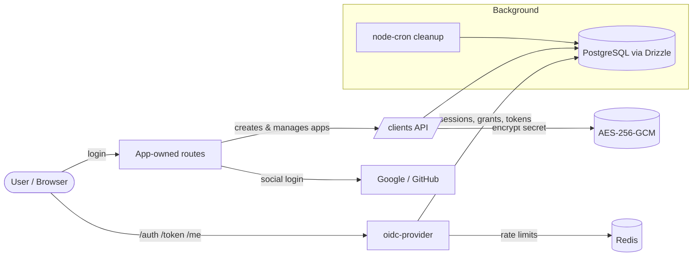

<div align="center">

# 🔐 OIDC Implementation

### A production-style OpenID Connect authorization server — with a Clerk-style developer dashboard built on top of the raw protocol.

<p>
  
  
  
  
  
</p>

<p>
  
  
  
  
  
</p>

</div>

<br>

> [!TIP]
> **What makes this different from a typical OIDC starter?** Most repos stop at "here's a spec-compliant provider." This one also ships the part every real auth platform (Clerk, Auth0, WorkOS) needs on top of the protocol: a **developer-facing dashboard API** where a logged-in user spins up an OAuth application, gets credentials once, and manages it afterward.

<br>

## 📖 Table of contents

- [What is this?](#-what-is-this)
- [Highlights](#-highlights)
- [Architecture](#-architecture)
- [Quick start](#-quick-start)
- [Environment variables](#-environment-variables)
- [API surface](#-api-surface)
- [`/clients` — the Clerk-style layer](#-clients--the-clerk-style-layer)
- [Postman collection](#-postman-collection)
- [Rate limiting & CORS](#-rate-limiting--cors)
- [Refresh tokens](#-refresh-tokens)
- [Logout & grant revocation](#-logout--grant-revocation)
- [Security notes](#-security-notes)
- [Project structure](#-project-structure)
- [Extending with a new identity provider](#-extending-adding-a-new-identity-provider)
- [Roadmap](#-roadmap--known-gaps)

<br>

## 🧭 What is this?

Two layers, living side by side in one codebase:

| Layer | What it does |
|---|---|
| 🛡️ **Protocol layer** | A spec-compliant OIDC provider — authorization code + PKCE, refresh token rotation, dynamic client registration (RFC 7591), discovery, JWKS, introspection/revocation, RP-initiated logout, pushed authorization requests |
| 🧩 **Product layer** | A `/clients` dashboard API — a logged-in user creates a named OAuth app, receives `client_id`/`client_secret` exactly once, and manages the app afterward, without ever touching the raw `/reg` endpoint |

Social login (Google + GitHub) with account linking by verified email is wired in, every OIDC artifact is persisted through a custom Drizzle adapter, and the auth/token endpoints are rate-limited through Redis.

<br>

## ✨ Highlights

| | |
|---|---|
| 🔑 **Core OIDC** | Authorization code flow, enforced PKCE, refresh token rotation |
| 🧩 **Client dashboard API** | `/clients` — create, list, fetch, delete OAuth apps per user |
| 🌐 **Social login** | Google + GitHub, linked by verified email |
| 🗄️ **Persistence** | Custom Drizzle ORM adapter backs every OIDC artifact (sessions, grants, tokens, clients) |
| 🚦 **Rate limiting** | Redis-backed fixed-window counters on auth/token endpoints |
| 🔒 **Secrets at rest** | Dashboard-created client secrets encrypted with AES-256-GCM, decrypted only when `oidc-provider` needs to verify them |
| 🧹 **Self-cleaning** | `node-cron` job sweeps expired rows every 15 minutes |
| 🚪 **Real logout** | Revokes every grant tied to the user, not just the local cookie |
| 📮 **Testable** | A full Postman collection covering every endpoint ships in the repo |

<br>

## 🏗️ Architecture



<br>

---

## ⚙️ Requirements

- Node.js 20+ (LTS)
- Docker + Docker Compose
- Bash / Git Bash / WSL (for `key-gen.sh`)
- OpenSSL

<br>

## 🚀 Quick start

```bash
cp .env.example .env
npm install
docker compose up -d          # Postgres + Redis
bash key-gen.sh               # RSA signing keys -> keys/
npm run db:generate
npm run db:migrate
npm run dev
```

> [!WARNING]
> **Port/URL consistency matters.** `PORT`, `ISSUER_URL`, `GOOGLE_REDIRECT_URI`, and `GITHUB_REDIRECT_URI` must all agree with each other *and* with whatever's registered in Google Cloud Console / GitHub OAuth App settings.

<br>

## 🔧 Environment variables

| Variable | Required | Purpose |
|---|---|---|
| `PORT` | ✅ | Port the server listens on |
| `DATABASE_URL` | ✅ | Postgres connection string |
| `REDIS_URL` | ✅ | Redis connection string (rate limiting) |
| `ISSUER_URL` | ✅ | Public base URL of this OIDC server |
| `SESSION_SECRET` | ✅ | Signs Express session cookies |
| `OIDC_COOKIE_KEYS` | ✅ | Comma-separated keys for `oidc-provider` cookie signing (deliberately separate from `SESSION_SECRET`) |
| `OIDC_PRIVATE_KEY_PATH` / `OIDC_PUBLIC_KEY_PATH` / `OIDC_JWKS_PATH` | ✅ | Paths to RSA signing keys generated by `key-gen.sh` |
| `CLIENT_SECRET_ENCRYPTION_KEY` | ✅ | 64-char hex (32-byte) AES-256-GCM key encrypting dashboard-created client secrets at rest. **Never rotate casually** — rotating it makes every previously-created client's secret permanently undecryptable |
| `GOOGLE_CLIENT_ID` / `GOOGLE_CLIENT_SECRET` / `GOOGLE_REDIRECT_URI` | optional | Google OAuth app credentials |
| `GITHUB_CLIENT_ID` / `GITHUB_CLIENT_SECRET` / `GITHUB_REDIRECT_URI` | optional | GitHub OAuth app credentials |
| `FRONTEND_URL` | optional | Allowed CORS origin for `/token` and `/me` (default `http://localhost:5173`) |
| `OIDC_CLIENTS_JSON` | optional | One-line JSON array of statically registered clients, for local testing only — real clients should go through `/clients` or `/reg` |

> [!NOTE]
> `OIDC_CLIENTS_JSON` must be valid JSON on a **single line**.
>
> To request a refresh token, **all three** of the following must hold: the client's `scope` includes `offline_access`, its `grant_types` includes `refresh_token`, **and** the `/auth` request includes both `scope=...offline_access` and `prompt=consent`.

> [!CAUTION]
> Never commit `.env` or `keys/*.pem`.

<br>

## 🔌 API surface

### Protocol endpoints (via `oidc-provider`)

| Endpoint | Purpose |
|---|---|
| `/.well-known/openid-configuration` | Discovery |
| `/jwks` | Public signing keys |
| `/auth` | Authorization |
| `/token` | Token exchange — rate-limited, CORS-scoped |
| `/me` | Userinfo — CORS-scoped |
| `/reg` | Anonymous dynamic client registration (RFC 7591) |
| `/revoke` / `/introspect` | Token revocation / introspection |
| `/session/end` | RP-initiated logout |
| `/request` | Pushed authorization requests |

### App-owned endpoints

| Endpoint | Purpose |
|---|---|
| `GET /login` | Provider-picker login page |
| `POST /logout` | Revokes all of the user's grants + tokens, then destroys the session |
| `GET /auth/external/:provider` / `.../callback` | Upstream OAuth — rate-limited |
| `GET /interaction/:uid` | Resolves `login` and/or `consent` prompts |
| `POST /clients` | Create a new OAuth application (auth required) |
| `GET /clients` | List the logged-in user's applications |
| `GET /clients/:clientId` | Get one of the user's applications |
| `DELETE /clients/:clientId` | Delete one of the user's applications |

<br>

## 🧩 `/clients` — the Clerk-style layer

Unlike `/reg` (anonymous, spec-level, no ownership concept), `/clients` requires a logged-in session and ties every application to its creator:

```bash
curl -X POST http://localhost:8000/clients \
  -H "Cookie: connect.sid=<session cookie>" \
  -H "Content-Type: application/json" \
  -d '{"name":"My App","redirectUris":["http://localhost:9000/callback"]}'
```

The response includes `client_id` / `client_secret` **exactly once** — the secret is never retrievable again (`GET /clients` and `GET /clients/:id` never include it).

**How it wires into the OIDC layer:** `DrizzleAdapter.find()` checks `oidc_payloads` first (covers `/reg`-created clients and every other OIDC artifact type). If a `Client`-type lookup misses there, it falls back to `oauth_clients` via `ClientRepository.findByClientIdForAuth()`, which decrypts the stored secret so `oidc-provider`'s built-in `client_secret_basic` comparison can succeed. Verified end-to-end: a client created via `POST /clients` completed a real `/auth` → login → `/token` flow and received valid tokens.

**Why encryption, not hashing, for these secrets:** `oidc-provider`'s default client authentication does a plaintext comparison, which one-way hashing (bcrypt/argon2) can't support — there's no way to "unhash" a secret to compare it. AES-256-GCM (encrypt/decrypt, not hash/verify) is the standard pattern here, the same approach many API-key systems use. The security boundary is keeping `CLIENT_SECRET_ENCRYPTION_KEY` separate from the database — not the secret being irreversible.

**Architecture:** this module uses full **controller → service → repository** layering with a Zod-based DTO (via the existing `BaseDto` pattern), unlike the flatter route-calls-repository style used elsewhere in the codebase. Deliberate — this module is expected to keep growing (secret rotation, usage limits, a dashboard UI).

<br>

## 📮 Postman collection

A complete collection covering every endpoint — discovery, JWKS, authorization,
token exchange (both grant types), userinfo, logout, all four `/clients`
routes, dynamic registration + registration management, revocation, and
introspection — ships at
[`postman/OIDC-Implementation.postman_collection.json`](./postman/OIDC-Implementation.postman_collection.json).

**To use it:**
1. Import the file into Postman.
2. Update the collection variables (`base_url`, `client_id`, `client_secret`,
   `code_verifier`, `code_challenge`) if your local setup differs from the
   defaults.
3. Requests are numbered in the order to run them. A few are interactive and
   marked **"browser only"** in their description (`/auth`, `/login`,
   `/session/end`) — these involve real login redirects Postman can't
   perform, so open the URL directly in a browser and copy the relevant
   value (`code`, `session_cookie`) back into the collection variables.
4. Endpoints that require a login session (`/logout`, all `/clients` routes)
   read a `{{session_cookie}}` variable — grab this from your browser's
   DevTools (Application → Cookies → `connect.sid`) after completing a
   login, per the description on request "0. Login".

> [!NOTE]
> **Verified vs. reference-only:** every request tagged with a step number
> that isn't "browser only" has been run against this exact codebase with
> real responses during development — not just assumed to work from reading
> the code. `/revoke`, `/introspect`, and the registration-management
> `GET`/`PUT`/`DELETE /reg/:client_id` requests are included and structurally
> correct, but see the Roadmap section below for their current test status.

<br>

## 🚦 Rate limiting & CORS

Redis-backed fixed-window counter, keyed by IP:

| Route | Limit |
|---|---|
| `/token` | 20 / 60s |
| `/auth/external/*` | 10 / 60s |

Fails **open** if Redis is unreachable (logs the failure and lets the request through).

CORS is scoped to `/token` and `/me` only, allowing just `FRONTEND_URL` as origin, credentials enabled.

<br>

## 🔄 Refresh tokens

Verified end-to-end including rotation: using a refresh token issues a new one and marks the old one consumed; reusing a consumed refresh token is rejected with `invalid_grant` (confirmed by test, not just by a DB flag).

<br>

## 🚪 Logout & grant revocation

`POST /logout` revokes every `Grant` (and its tokens) belonging to the session's user — not just the local session — verified with a user who had grants across multiple client apps.

> [!NOTE]
> Grant lookup by user currently scans all `Grant` rows and filters by payload `accountId` in application code, since that field isn't an indexed column. Fine at current scale.

<br>

## 🛡️ Security notes

- PKCE required for all clients.
- Upstream OAuth `state` is stored in `oauth_states`, 10-minute expiry, single-use.
- Session cookies: `httpOnly`, `secure` in production, `sameSite: lax`.
- `SESSION_SECRET`, `OIDC_COOKIE_KEYS`, and `CLIENT_SECRET_ENCRYPTION_KEY` are three separate secrets.
- `/token` and `/auth/external/*` are rate-limited; `/token` and `/me` are CORS-scoped.
- Logout revokes grants; refresh tokens rotate and reject reuse.
- Dashboard-created client secrets are encrypted at rest (AES-256-GCM), never stored in plaintext.
- **Auth-failure logging reviewed:** upstream Google/GitHub error responses
  are logged server-side in full (for debugging) but never reflected back
  to the API caller — callers get a generic message
  (e.g. `"Google token exchange failed"`) instead of the raw upstream body.
  Previously, the raw body was embedded directly in the error returned to
  callers; this was found and fixed.

<br>

## 🧹 Expired-row cleanup

A `node-cron` job runs every 15 minutes, deleting expired `oidc_payloads` and `oauth_states` rows. Verified manually against real accumulated test data before relying on the schedule.

<br>

## 📁 Project structure

```
src/
├── app.ts
├── server.ts
├── common/
│   ├── config/             # env loader
│   ├── db/                 # Drizzle client + schema
│   ├── middleware/          # session, error handler, rate-limit, cors
│   ├── redis/               # shared Redis client
│   ├── jobs/                # cleanup-expired.job.ts, schedule-cleanup.ts
│   ├── dto/                 # BaseDto (Zod-based)
│   └── utils/                # api-error, api-response, crypto (AES helper)
└── modules/
    ├── keys/                 # key loading, JWKS, mint-initial-access-token.ts
    ├── users/                # user + identity linking
    ├── identity-providers/   # google/, github/, core/
    ├── auth/                 # login page, logout (with grant revocation)
    ├── oidc/                 # oidc-provider config, Drizzle adapter,
    │                         # interaction handler, findAccount
    ├── clients/               # DONE — client.repository/service/controller/
    │                          # routes/dto, adapter-wired for real login
    └── tokens/                # reserved, not yet used
postman/
└── OIDC-Implementation.postman_collection.json
```

<br>

## 🔌 Extending: adding a new identity provider

1. Create `src/modules/identity-providers/<provider>/`.
2. Implement `IdentityProvider` (`isEnabled`, `getAuthorizationUrl`, `exchangeCodeForProfile`).
3. Add env vars to `src/common/config/env.ts`.
4. Register it in `src/modules/identity-providers/index.ts`.
5. The login page already loops over `registry.listEnabled()` — no template change needed.

<br>

## 🗺️ Roadmap / known gaps

- [ ] `modules/tokens` — empty, unused
- [ ] `/revoke`, `/introspect`, and registration-management (`GET`/`PUT`/`DELETE /reg/:client_id`)
      are wired and included in the Postman collection but haven't been run
      against live responses the way the rest of the flows have — worth a
      pass before treating them as fully verified
- [ ] Grant lookup by user scans all rows rather than using an indexed column — fine now, won't scale indefinitely as-is
- [ ] No secret rotation flow for dashboard-created clients (can't regenerate a `client_secret` without deleting and recreating the app)
- [ ] No per-client usage tracking or dashboard UI — the API exists; nothing visual sits on top of it yet
- [ ] No frontend yet — a Vite + React dashboard consuming `/clients` and the login flow is the natural next milestone; CORS is already scoped for `http://localhost:5173` in anticipation of this

<br>

## 📝 Notes

- `docker-compose.yml` covers Postgres + Redis for local dev.
- `dist/` is generated — never edit directly.
- Schema changes need `npm run db:generate` + `npm run db:migrate`.
- `bcryptjs` (not `argon2`) is used elsewhere for anything that genuinely needs one-way hashing — `argon2` requires native compilation unavailable in some Windows dev setups. Client secrets specifically use reversible AES encryption instead, for the reason explained above.

---

<div align="center">

**Built as a reference implementation of OIDC done properly** — protocol compliance *and* the developer-facing layer real platforms need on top of it.

<sub>Express · TypeScript · Drizzle ORM · PostgreSQL · Redis · `oidc-provider`</sub>

</div>